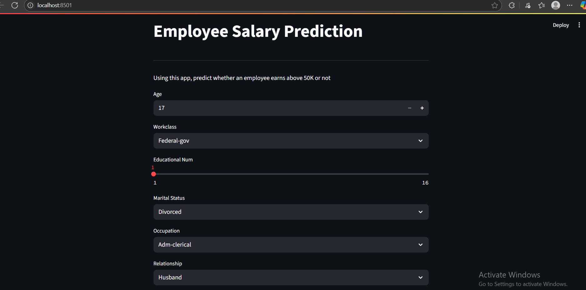

# Employee Salary Prediction using Machine Learning

This project aims to predict employee salaries based several inputs using machine learning techniques. The model is built using XGBoost and deployed with a user-friendly interface using Streamlit.

---

## Project Overview

- **Goal**: Predict salaries of employees given various input features.
- **Tech Stack**: Python, Pandas, Scikit-learn, XGBoost, Streamlit
- **Model Used**: XGBoost Classifier
- **Interface**: Streamlit-based web app

---

## 📂 Project Structure

- app.py # Streamlit app
- new.ipynb # Jupyter notebook with training & preprocessing
- model.joblib # Trained ML model
- dataset.csv # Provided dataset
- README.md # Project documentation
- requirements.txt # Python dependencies

---

##  How to Run the Project

### 1. Clone the Repository
```bash
git clone https://github.com/cv05x/Employee-Salary-Prediction.git
cd employee-salary-prediction

```
### 2. Install Dependencies
```bash
pip install -r requirements.txt

```

### 3. Run the Streamlit App
```bash
streamlit run app.py

```


## Features
- Data preprocessing with label encoding
- Model training using XGBoost
- Model evaluation using metrics like accuracy and confusion matrix
- Web interface to input new data and get predictions

## ML Workflow
- Load and preprocess the data
- Encode categorical features
- Train/test split
- Model training with XGBClassifier
- Evaluate model using accuracy, ROC-AUC, and confusion matrix
- Save model with joblib
- Deploy with Streamlit

## Sample Screenshot



## License

This project is licensed under the [MIT License](LICENSE).  
You are free to use, modify, and distribute this project with proper attribution.


